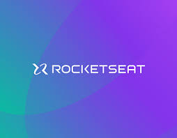
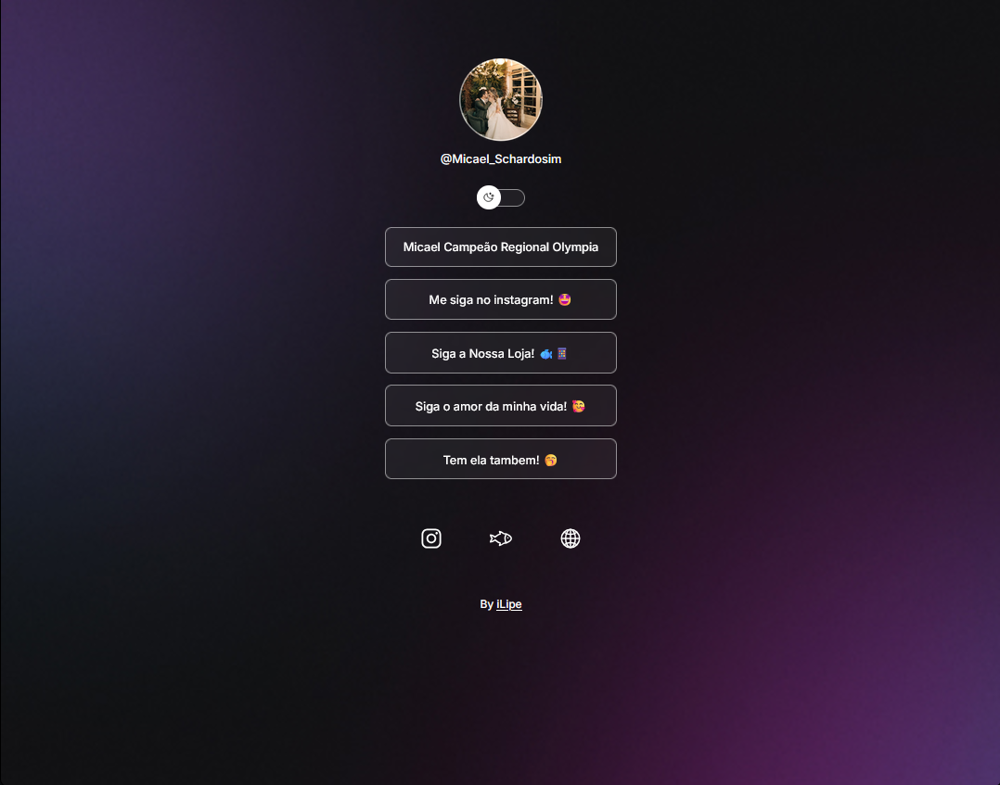

<div align="center">

# 🔗 DevLinks

### Projeto estilo Linktree desenvolvido com HTML, CSS e JavaScript



<br>

<p align="center">
  
  
  
  
</p>

</div>

---

# 📌 Sobre o projeto

O **DevLinks** é uma aplicação inspirada no Linktree, desenvolvida durante os estudos da Rocketseat.

O objetivo do projeto foi praticar conceitos fundamentais de desenvolvimento web utilizando HTML, CSS e JavaScript, criando uma página moderna, responsiva e com alternância entre temas claro e escuro.

---

# ✨ Funcionalidades

- 🌙 Alternância entre Dark Mode e Light Mode
- 📱 Layout responsivo
- 🔗 Links personalizados
- 🎨 Interface moderna
- ⚡ Interatividade com JavaScript
- 🖼️ Perfil personalizado

---

# 🚀 Tecnologias utilizadas

- HTML
- CSS
- JavaScript
- Git
- GitHub

---

# 📂 Estrutura do projeto

```bash
📦 projeto
 ┣ 📂 assets
 ┣ 📜 index.html
 ┣ 📜 style.css
 ┣ 📜 script.js
 ┗ 📜 README.md
```

---

# 💻 Como executar o projeto

Clone o repositório:

```bash
git clone https://github.com/seu-usuario/seu-repositorio.git
```

Acesse a pasta do projeto:

```bash
cd seu-repositorio
```

Execute o arquivo:

```bash
index.html
```

---

# 📸 Preview

<div align="center">



</div>

---

# 📚 Aprendizados

Durante o desenvolvimento deste projeto foram praticados conceitos como:

- Estruturação com HTML
- Estilização com CSS
- Alternância de temas com JavaScript
- Organização de projeto

---

# 👨‍💻 Autor

## Desenvolvido por **Felipe Ribeiro** durante os estudos da Rocketseat 🚀

# 🎓 Professor do Projeto

<div align="center">


<br><br>

### Mayk Brito

Educador na Rocketseat 🚀

Responsável por ensinar os fundamentos utilizados durante o desenvolvimento deste projeto.

</div>

---
